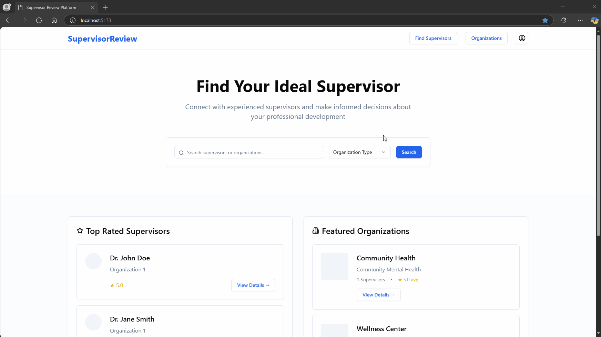
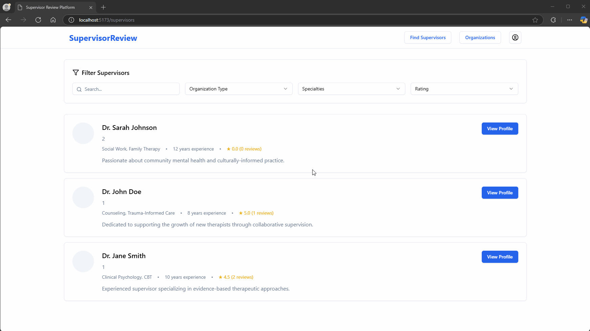
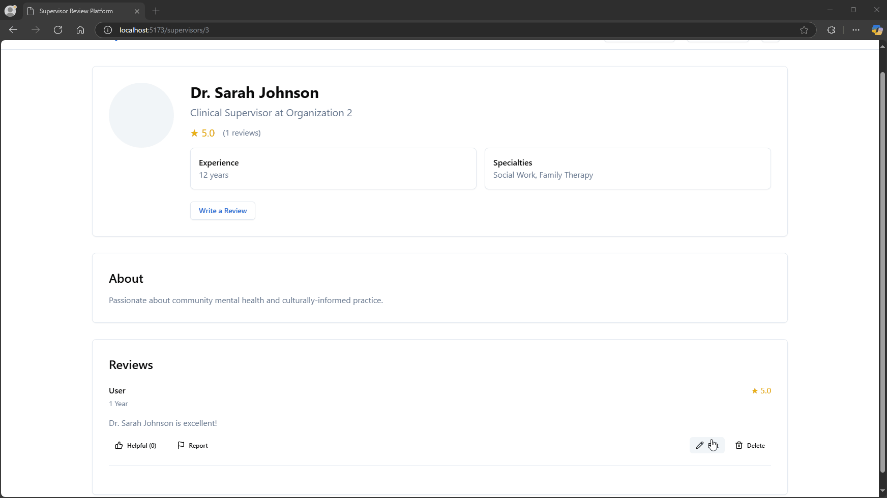
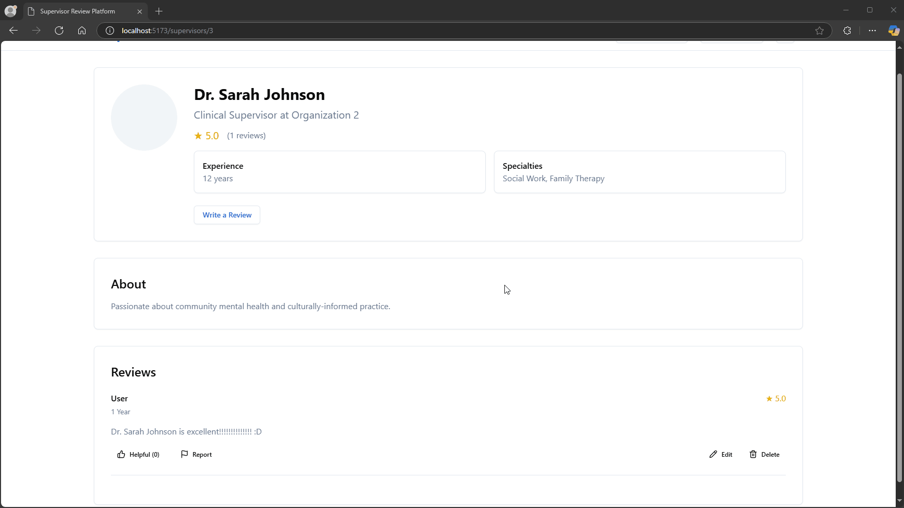
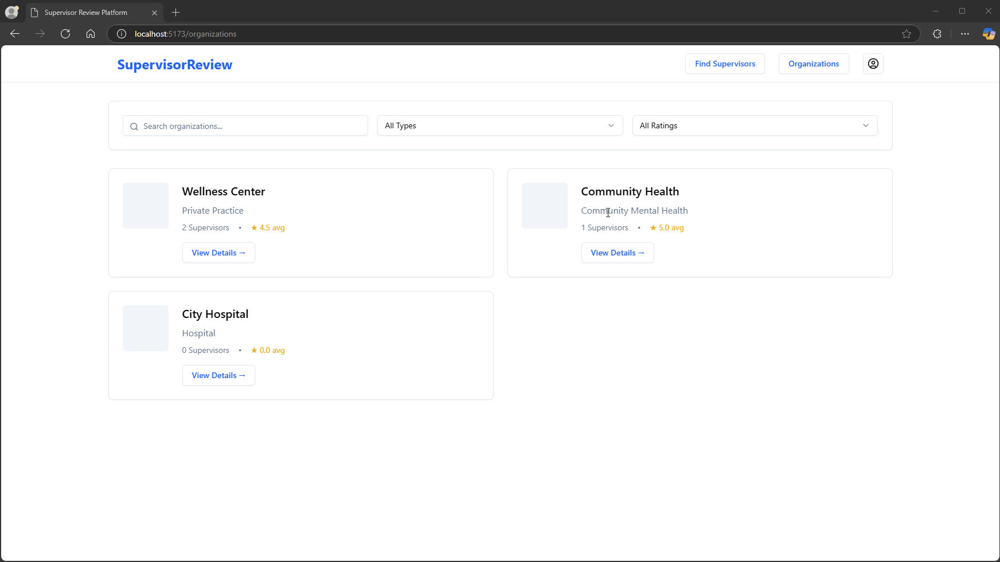

# Rate My Supervisor

CodePath WEB103 Final Project

Designed and developed by: Alexandre Steinhauslin, Shi Zhang, Timothy Chung

🔗 Link to deployed app: https://rate-my-supervisors.vercel.app

## About

### Description and Purpose

Rate my Supervisor is a web application like Rate my Professor that allows Intern and Associate therapists to rate their supervisor.

### Inspiration

The current state of the internship/apprenticeship environment in the state of California.

## Tech Stack

Frontend: React, Tailwind CSS

Backend: Node.js, Express, PostgreSQL, Railway

## Features

### ✅ View List of Organizations and Supervisors

Users can browse a comprehensive list of organizations and their associated supervisors to explore available options and read reviews.

### ✅ View Reviews for Organizations and Supervisors

Users can see a list of reviews for a particular supervisor or an organization.

### ✅ Add Reviews for Organizations and Supervisors

Users can add reviews for a particular supervisor or an organization.

### ✅ Update Reviews for Organizations and Supervisors

Users can edit reviews for a particular supervisor or an organization.

### ✅ Delete Reviews for Organizations and Supervisors

Users can remove reviews for a particular supervisor or an organization.

### ✅ Filter Organizations and Supervisors

Users can filter to see the desire results based on organizations, specialties, and ratings.

## Installation Instructions

- Clone the repo
- `npm install`
- `npm run dev`
